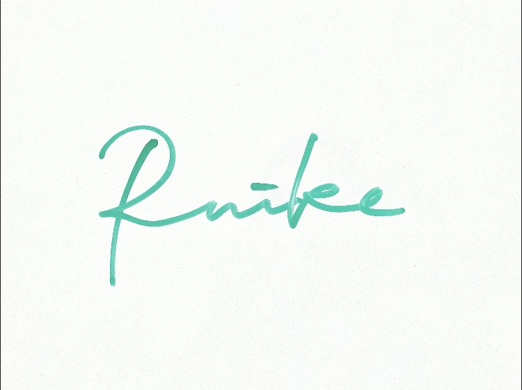

Chisato Ruike

<h2 class="mt-4">Education</h2>
<ul>
<li>March 2023: Bachelor of Science, College of Physics, School of Science and Engineering, University of Tsukuba</li>
<li>March 2025: Master of Science, Physics Degree Program, Graduate School of Science and Technology, University of Tsukuba</li>
</ul>

<h2>Research Field</h2>

I conduct theoretical research in low-energy nuclear physics.

<h2>Research Interests</h2>

<h3>Nuclear Superfluidity Research</h3>

I study the structure of superfluid nuclei with pairing correlations, mainly using density functional theory from the perspective of collective motion.

<h2>Skills</h2>

Programming

<ul>
<li>C</li>
<li>Fortran (learning)</li>
<li>Python (learning)</li>
</ul>

<h2>Hobbies</h2>

Hula dancing, dancing, painting, flowers, animals, koto (Japanese zither)

<h2>Academic Memberships</h2>
<ul>
<li>The Physical Society of Japan</li>
</ul>

 